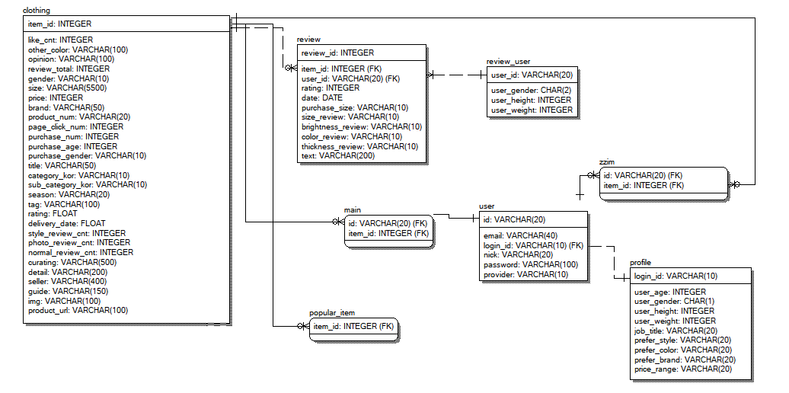

# 프로젝트 개요
유저의 나이, 성별, 키, 몸무게, 선호스타일, 선호컬러, 선호브랜드, 선호가격대를 바탕으로 패션 아이템을 추천해주는 서비스입니다.

## <문제상황>
많은 패션 아이템 속에서 취향과 신체조건에 맞는 아이템을 찾아 구매하기까지 많은 시간이 소요됩니다.   
또는 유행하는 옷을 입고싶은데 인기 아이템이 무엇인지 모르는 경우가 있습니다.

## <가정>
1. 내 취향에 맞고 나에게 어울리지만 내가 지금까지 안 입었던 옷을 구매하고 싶은 경우
2. 내가 과거에 구매했던 옷과 비슷한 옷을 구매하고 싶은 경우

--------------
# 프로젝트 구조
## <데이터셋 구축>
온라인 패션 플랫폼 데이터 사용
* 데이터셋 구축 과정  
    - 시작 
    - 데이터 파이프라인 설계 
    - 통합 
    - 데이터 저장 방법
    - DB 설계 
* EDA 
    - EDA 
* ERD  

## <사용 알고리즘>
1. Collaborative Filtering 
    - 내 취향에 맞고 나에게 어울리지만 내가 지금까지 안 입었던 옷을 구매하고 싶은 경우에 적합합니다.
    - 유저 사이의 유사성을 바탕으로 나와 비슷한 유저들이 상호작용한 아이템을 추천합니다.

2. Content Based  
    - 내가 과거에 진짜 고심해서 골라 구매했던 옷과 비슷한 옷을 구매하고 싶은 경우에 적합합니다.
    - 아이템 사이의 유사성을 바탕으로 제품 정보 사이의 유사도가 높은 제품을 추천합니다.

3. Hybird
    - Collaborative Filtering + Content Based

4. 추천 정확도를 높이기 위해 사용한 방법
    - 분류분석 
    - NLP 

5. 알고리즘 평가 방법
    - recall@5, recall@10
    - 관련 문서 

6. 추천시스템 관련 조사 & 스터디  
    - CF 조사 
    - CB, Hybrid 조사
    - 추천시스템 코드 스터디 

## <웹 개발>
UI 설계  

프로토타입  

----------
# 개발 스택 및 프레임워크

----------
# 결과물
진행시 사용했던 notion의 일부를 공유합니다.
https://www.notion.so/OLOOK-17d5aede1ade4f9dbab130a054e86eaa

------------
# 웹페이지 링크
http://project-olook.herokuapp.com/

------------
# 느낀점  
민지 - 추천시스템... 어렵네요..ㅋㅋㅋ 데이터 수집, 전처리하는 과정이 너무 오래 걸려서 생각만큼 디테일하게 추천시스템 구현을 못한 것이 아쉽긴합니다ㅠ 그래도 어려운 문제를 해결해보려하고 웹으로까지 구현을 해봤다는게 엄청 뿌듯합니다!! 다들 고생많으셨습니다.  
유빈 - 프로젝트에 필요한 많은 과정을 경험해볼 수 있어서 좋았습니다! 아쉬운 점은 미리 컬럼들을 정의했지만 개발 과정에서 필요한 컬럼들이 더 있었다는 점이었어요. 모든 기획을 다 마친 상태에서 데이터 수집이 이루어졌으면 더 좋았겠다는 생각이 듭니다! 웹이 예쁘게 만들어져서 볼 때마다 뿌듯해요! 모두 고생 많으셨습니다!

