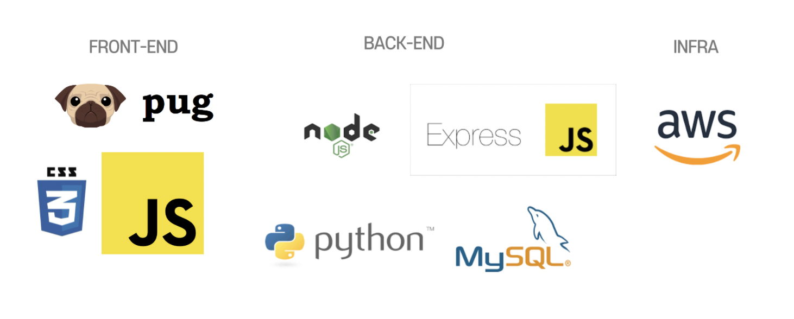

# 프로젝트 개요
## <문제상황>
내 취향에 맞는 옷을 고르기가 어렵다. 

유행하는 옷을 입고싶은데 옷이 너무 많아서 뭔지 잘 모르겠다.

패션 아이템이 너무 많아 구매까지의 시간이 너무 오래걸린다.

## <가정>
내 취향에 맞고 나에게 어울리지만 내가 지금까지 안 입었던 옷을 구매하고 싶다.

내가 과거에 구매했던 옷이랑 비슷한 옷을 구매하고 싶다.  

# 프로젝트 구조
## <데이터셋 구축>
1. 활용 데이터 & 수집방법  
    - 무신사(온라인 패션 플랫폼) 데이터 scraping
    - Selenium Library
2. 사용 컬럼
    - Fashion Data
    
    
    - User & Review Data
    

3. 데이터셋 구축 프로세스 

4. 최종 데이터셋

## <사용 알고리즘>
1. Collaborative Filtering 
    - 내 취향에 맞고 나에게 어울리지만 내가 지금까지 안 입었던 옷을 구매하고 싶은 경우
    - 유저 사이의 유사성

2. Content Based  
    - 내가 과거에 구매했을 때 진짜 고심해서 골랐음
    - 내가 과거에 구매했던 옷과 비슷한 옷을 구매하고 싶은 경우
    - 아이템 사이의 유사성

3. Hybird
    - Collaborative Filtering + Content Based

4.알고리즘 평가 방법

## <웹 개발>
UI 설계  
https://www.notion.so/UI-63322268f68a47b39b3b06a517df966a  
프로토타입  
https://www.figma.com/file/3OxoDhJtMDWrTDgsEFQLix/오늘의-룩?node-id=113%3A2

# 개발 스택 및 프레임워크

# 결과물

# 개발하면서 느낀 점
